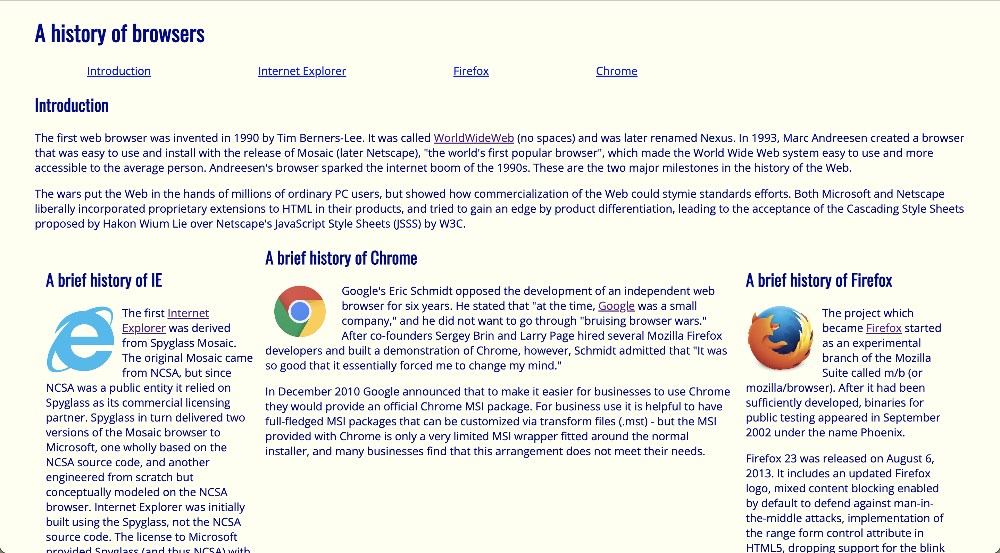
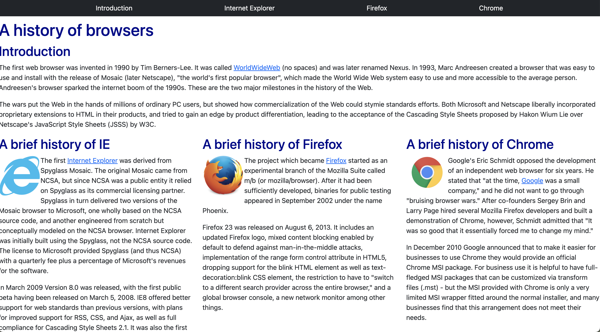

  

## My Prior Experience
Prior to this course, I had no experience doing any sort of web design. While getting a general idea of how many people had experience with HTML and CSS, I was one of the few who sat in front of their computers with their hands down. That being said, with a lack of experience with HTML and CSS, I also have never worked with UI frameworks. I have always been interested in website and application design, so this is a great opportunity for me to put in a lot of effort and get a good grasp of the concepts during this unit.

## What is a UI Framework?
Many people use a UI or user interface in their daily lives but they are often unaware of the complexities behind their simple-looking screens. The user interface (UI) is the collection of screens, websites, and visual elements that allow a user to interact with a service or product. Users interact with the UI while accessing websites or applications, however, developing such websites often require knowledge of languages such as HyperText Markup Language (HTML) and Cascading Style Sheets (CSS). This is where UI frameworks can aid the process by reducing the time and difficulty of using just HTML and CSS. 

A UI framework is a software tool for creating software programs to run on the web. In other words, the UI Framework is a set of classes and interfaces that define the elements and behavior of a window-based UI Subsystem. They are very similar to libraries of different languages I have experience with. In ICS 314, we used Bootstrap 5 as the UI framework, which had helpful organization and styling templates for components such as buttons, navigation bars, input bars, and dropdown menus.

## A Whole New World
Having no experience working with HTML, CSS, and Bootstrap made completing the recent exercises a bit difficult. Practicing through freeCodeCamp provided a good basis to get started, but I found great difficulty in navigating between all of the new tags, anchoring things, creating classes, and using id names. Also, compared to JavaScript, the lack of curly braces makes it a little difficult for me to follow the code I am writing. The documentation for the UI framework, Bootstrap 5, felt a bit limited especially when it came to recreating websites. Oftentimes, due to my lack of experience, I felt like my results could have improved style-wise.

Although it was difficult for me to pick up, there are many reasons to learn to use a framework, such as Bootstrap 5.  For example, Bootstrap 5 allowed the websites to look professional and clean without too much effort put in. Rather than using just HTML and CSS to customize each portion of the website, developers can use various built-in components, such as a navigation bar, footer, containers, and buttons, by using appropriate tags and classes. Once again, this saves the time and effort which can be spent somewhere else.

## Web Page Comparison
After investing the same amount of time and effort in researching and attempting different formats of code, the website using Bootstrap has a much cleaner and aesthetically pleasing look as seen in the photos below.

  
  

These are other examples of I was able to produce using Bootstrap efficiently.

  
  

  
  

