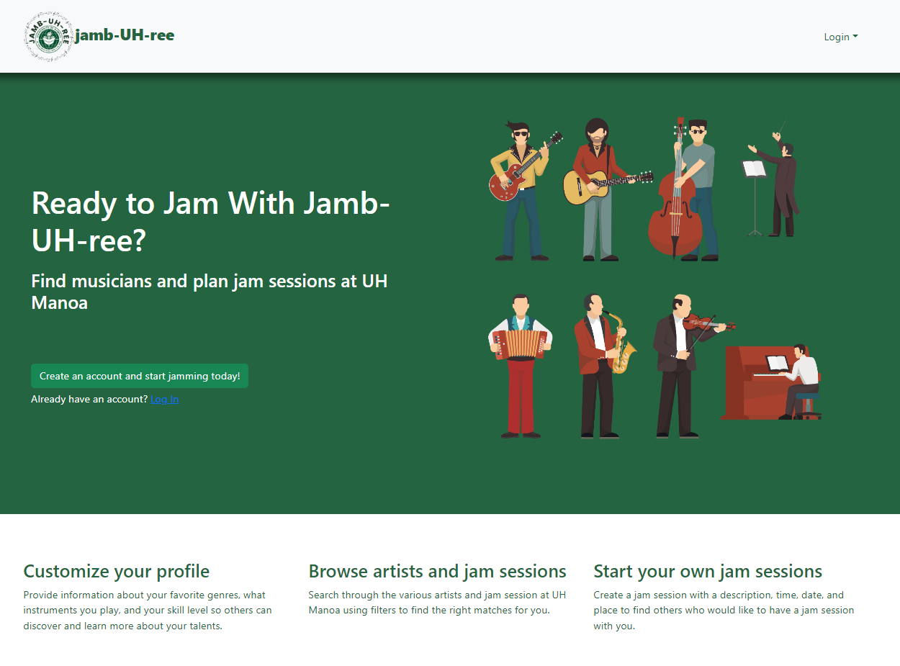
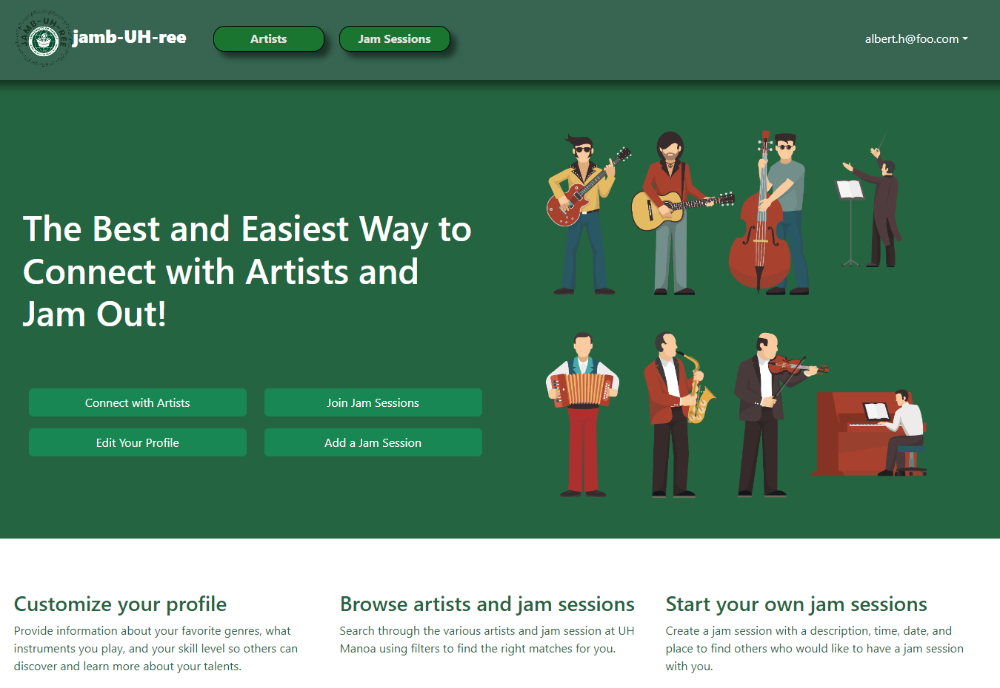
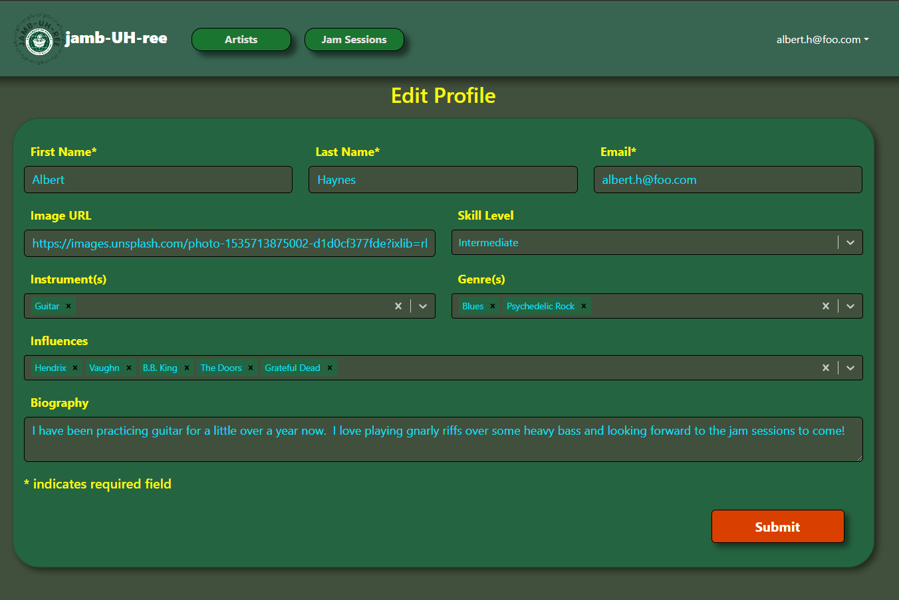

  

## What is jamb-UH-ree?
[jamb-UH-ree](https://jamb-uh-ree.site/) is a project intended to help the University of Hawaii at Manoa’s musicians connect with one another through student-created jam sessions. The website will help musicians connect with others based on similar skill levels, genres, interests, influences, and instruments.

In this application, users can create an account or log in. Once logged in, the user would curate their profile, which will be displayed on the "Artists" page, based on information about themselves. Once their profile is made, the user can visit the "Jam Sessions"  page to join and leave jam sessions. Users can also create their own jam session for others to join by filling in the information, such as the date, venue, genre, instruments, and a more detailed description.

## My Contribution
For this project, my group was comprised of four members: Caleb Mueller, Reid Lum, Elis Diep, and myself. The team utilized a type of agile project management called Issue Driven Project Management. This method allowed us to distribute the work through the use of GitHub projects and issues. After discussion through meetings outside of class, tasks were each given an individual issue and branch where we could work on the issue. Overall, I found the organization of tasks to be really helpful for keeping track of progress and who completed each task.

I created the logo for jamb-UH-ree. I also worked on the development of some of the web pages, such as the edit profile page and the sign-in landing page, and components, such as the navbar and footer. Within the edit profile and create jam session pages, I worked on creating the required fields in order for the submission of the form to work.

    
    

## Great Learning Experience
From this project, I learned the importance how to use React, Bootstrap, Meteor, MongoDB, Digital Ocean, and TestCafe to create a web application. This was my first experience brainstorming an idea, implementing it, and adjusting based on user input. Given more time, we could definitely improve the functionality of certain features, such as creating a way to edit the jam sessions users create. From this project, I also learned the importance of working in a team and keeping project management organized. Having a team to bounce ideas off of and utilizing the GitHub issues allowed for an efficient development process. After having experienced a project like this from start to finish, I think I may be interested in pursuing a career that involves this type of work. Overall, I am extremely proud of my team and jamb-UH-ree!

## Let's Jam!
* [jamb-UH-ree](https://jamb-uh-ree.site/)
* [GitHub](https://github.com/jamb-uh-ree)
* [Project Home Page](https://jamb-uh-ree.github.io/)
