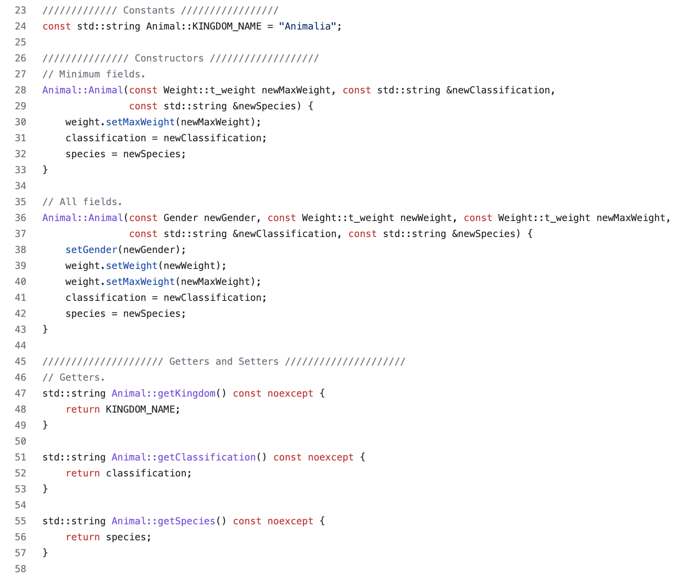

  

## What is jamb-UH-ree?
[jamb-UH-ree](https://jamb-uh-ree.site/) is a project intended to 

## My Contribution
My role during this project was 

## Great Learning Experience
From this project, I learned the importance of 

## Let's Jam!
* [jamb-UH-ree](https://jamb-uh-ree.site/)
* [GitHub](https://github.com/jamb-uh-ree)
* [Project Home Page](https://jamb-uh-ree.github.io/)

