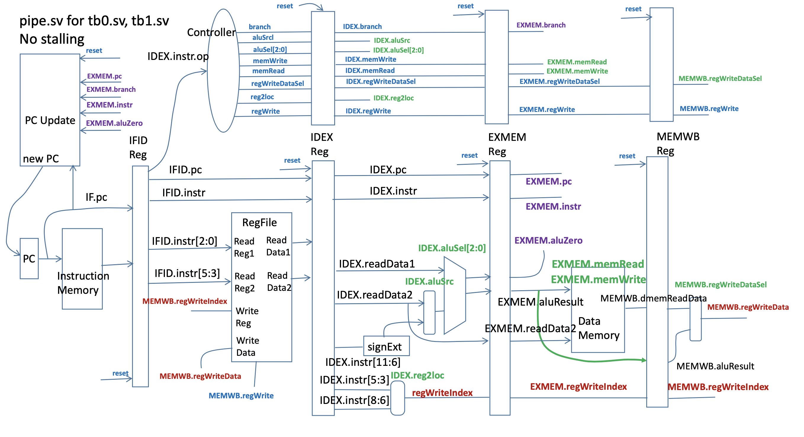

  

A PipeLite is a simplified version of a five-stage pipelined processor that runs on the same instruction set as the SingleLite computer. It is important to note that everything is synchronized with the positive clock edge, except the register file, which is synchronized with the negative clock edge. Some of the differences from the SingleLite single-cycle processor include that there are registers IFID, IDEX, EXMEM, and MEMWB buffers between the stages; the controller and PC logic may differ from the single-cycle processor; it is assumed that the only instructions executed are ADDI, SUBI, ADD, CBZ, B, and NOP; and the reset will clear the PC and set the IFID, IDEX, EXMEM, and MEMWB buffers so they do NOP operations. Note that resetting all of the buffers will avoid device outputs with an “x” at initialization, which will cause problems with debugging.

My role during this project was to take what we had learned during class and implement it into the design of the processor. It was also my role as a student to make time to work on this long term independent project and ask the professor questions when needed. To make sure that I was able to complete this project, I created a schedule of set times to work on the code and lab report.

During this project, I was able to understand how to implement a PipeLite on [edaPlayground](https://edaplayground.com/x/dZyv) using SystemVerilog and the SingleLite computer diagram. In general, I was able to learn more about pipeline processors and how they work. I was introduced to the PipeLite processor by comparing it to the SingleLite processor. The block diagrams given to me allowed me to understand how everything was connected. During the tasks, I was able to make modifications, such as implementing new instructions and logic in the controller, to the PipeLite design using SystemVerilog. These modifications allowed the programs that were implemented in four different testbenches to execute. These modifications helped us gain a greater understanding of data and control hazards and how processors stall to avoid incorrect execution of instructions. This lab was very difficult and really put the knowledge and skills I have accumulated throughout this semester to the test. 
